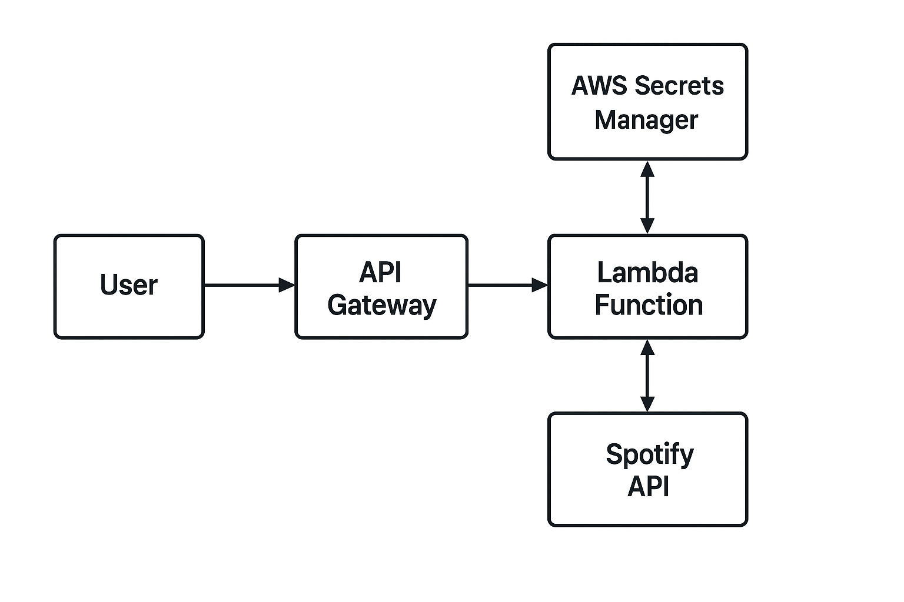

# MoodyStream: Spotify Playlist Generator on AWS Lambda

## Overview

MoodyStream is a cloud-native web application that generates Spotify playlists based on a user’s favorite artists. It demonstrates:

- Serverless architecture with AWS Lambda and API Gateway  
- Spotify OAuth 2.0 Authorization Code Flow  
- Secure credential storage using AWS Secrets Manager  
- Python application packaging for cloud deployment  

---

## Architecture Diagram


_User → API Gateway → Lambda Function → Spotify API / AWS Secrets Manager_


---

## Technologies & Services Used

- **AWS Lambda**
- **AWS API Gateway**
- **AWS Secrets Manager**
- **IAM (Role-Based Access Control)**
- **Python 3.12**
- **Flask**
- **Spotipy**
- **Mangum**

---

## Features

- Authenticate via Spotify using OAuth 2.0  
- Generate playlists using:  
  - Top tracks from user’s favorite artists  
  - As well as less popular tracks from those same artists  
- Store credentials securely in AWS Secrets Manager  
- Serverless

---

## Setup Instructions

### Spotify

Visit `https://developer.spotify.com/`

Log in with Spotify account and navigate to your dashboard

Click "Create app"

Fill out "App name", "App description" and add `http://127.0.0.1:8888/callback` to the "Redirect URI"

Check "Web API" box and agree to the terms

Once you have created the app you can see you **Client ID** and **Client Secret**

### Local


Clone the repository:
```bash
git clone https://github.com/your-username/moodystream.git
cd moodystream
```

Install dependencies:
```bash
pip install -r requirements.txt
```

Copy secrets into `.ENV` file:
```env
SPOTIPY_CLIENT_ID=your_client_id
SPOTIPY_CLIENT_SECRET=your_client_secret
SPOTIPY_REDIRECT_URI=http://127.0.0.1:8888/callback
SCOPE=user-top-read playlist-modify-public
```

Run application:
```
python main.py
```

### Security Considerations

- OAuth credentials stored in AWS Secrets Manager
- IAM roles restricted with least privilege
- No long-term user data storage
